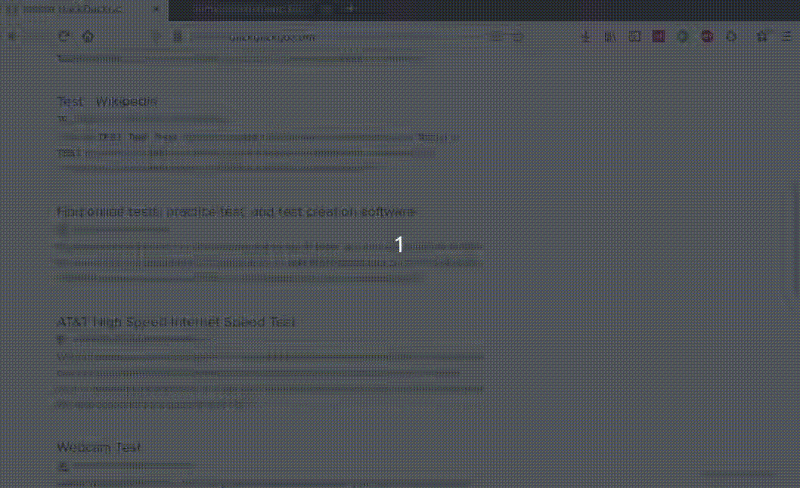

# Quick Peek Browser Extension

Quick peek at links without leaving your 
current browser tab. 

## Installation
- Install via Mozilla Addons: https://addons.mozilla.org/en-US/firefox/addon/quick-peek-for-firefox/

## How to use it:

You can peek at urls by right-clicking (or cmd-click on MacOS) and selecting the item `Peek`. We also register the shortcut key `E` for quick peeking.

Right-click on a Link > Peek (or press `E`)

- To visit the url, click on the preview
- To discard the preview, press `ESCAPE` or `Q`
- To discard the preview but keep the tab for later
pres anywhere outside of the preview.

## How it works:
When you request a peek this extension will open
the link in a new tab, takes some screenshots and
display these screenshots in the right bottom corner
of your current tab.

An alternative method was also considered, namely
using an iframe. In many cases the iframe option seemed problematic (https -> http, X-Frame-Options, etc), and these solutions have been dropped in favor
of the current captureTab method. 

## Tested on
- Firefox 70

